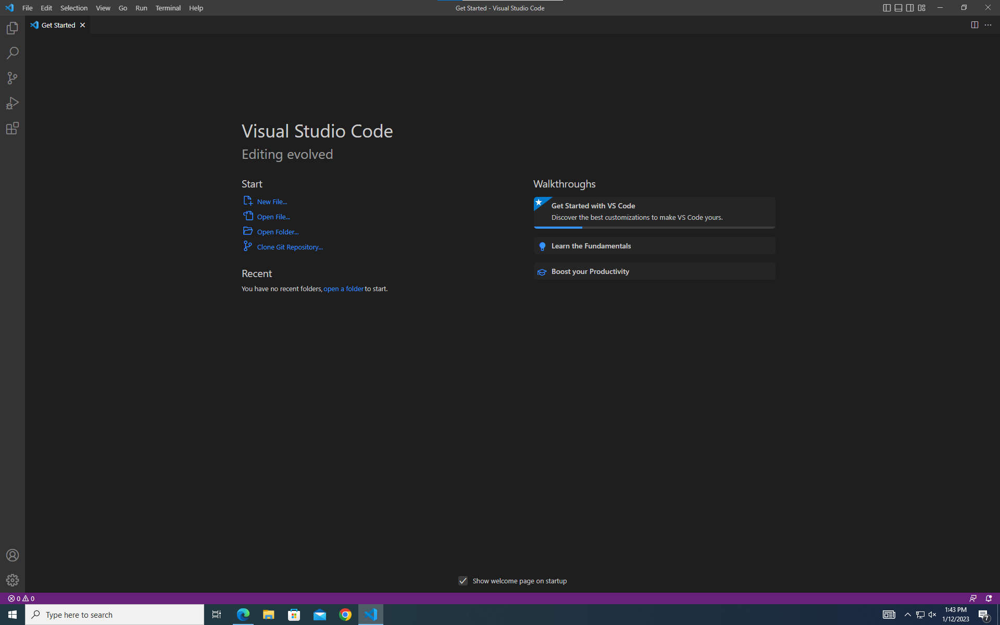
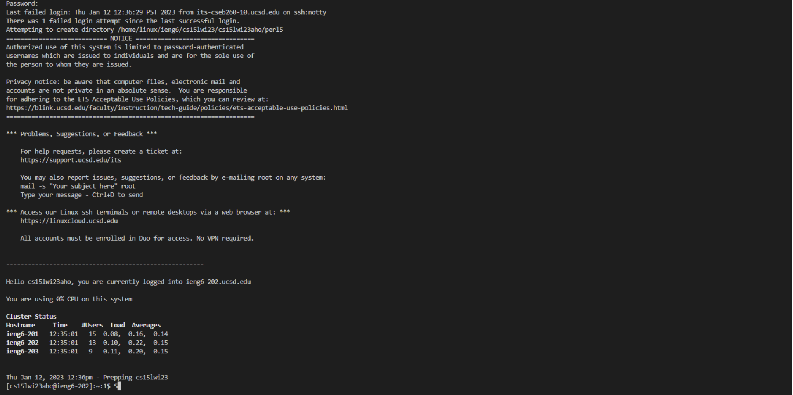

# WEEK 1 LAB REPORT
## INSTALLING VISUAL STUDIO CODE
Go to [VScode](https://code.visualstudio.com/) and click on the _blue box_ that says "Download for Windows", or change the downloading option according to your OS.\
Go to your downloads (Ctrl+J) and click on _"Open File"_ under VSCodeUserSetup. \
However, my personal laptop and the computer I was using already had VSCode installed, and I was able to skip this step. \
From your downloads, click on Visual Studio Code, and once you open it, it should look like:

 
## REMOTELY CONNECTING
First, make an account / log into existing account [here](https://sdacs.ucsd.edu/~icc/index.php).\
If you're using windows, install [Git](https://gitforwindows.org). To use _ssh_, pen a terminal in VSCode bye clicking on 'Terminal' at the top and the clicking on 'New Terminal'. Enter the following command: `ssh cs15lwi23zz@ieng6.ucsd.edu` \
However, replace 'zz' with the letters from your account name. For example, if your account name is __cs15lwi23hlo__, your command would be `ssh cs15lwi23hlo@ieng6.ucsd.edu`. Once you enter the command, you will be asked to enter your password. \

*__Note:__* while entering your password, the password will not be displayed. However, the device is still accepting your entries. Enter the correct password and it will let you go ahead successfully!

Your screen should look like:

If you see, the beginning of the image says "Last login failed:". this is because while entering my password, I was not aware that the computer is accepting my typed letters, and ended up entering the same key multiple times, thereby entering the incorrect password. 

## TRYING SOME COMMANDS
Here are certain commands you could enter: 
`cd, ls, pwd, mkdir, and  cp`
Find below what the `cd` command looks like

`cd` is change directory, ‘~’ refers to the home directory. Since we’re already at the home directory, it doesn't make a difference. Initially, I tried to run the same command but I forgot to add a space between cd and ~. Hence, there was an error message saying “command not found”.

`ls` : used to to list files and folders of the given path.
On trying this comand, it listed the files in the directory.
`pwd` displays the current working directory
`mkdir` allows users to create directories
`cp` stands for copy and is used ot copy files or group of files or directory.

