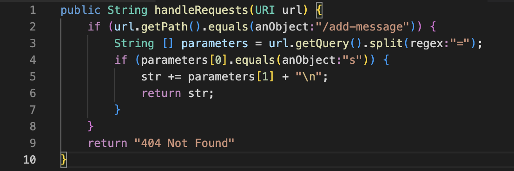
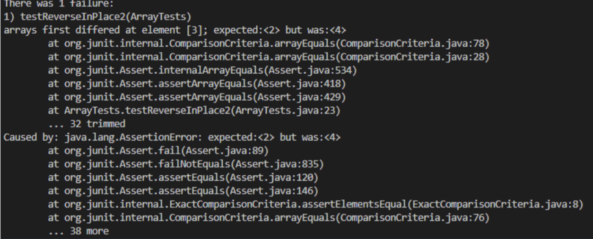
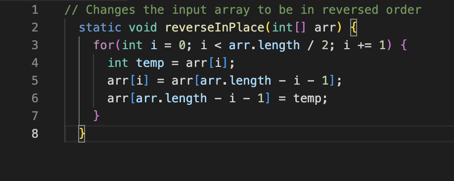

# Lab Report 2 - Servers and Bugs (Week 3)
## Part 1
Find below my code for StringServer

Using add-messages:
1. This is with only one string addition. The url is _localhost:4000/add-message?str=Hello_ which displays "Hello". 
For this, `handleRequest` is called. The relevant argument is __URI url__. The string str gets changed from empty string to _Hello_. This is because Java Server calls HandleRequests which modifies the output by adding "hello" to the query.

2. I added a few more strings. This is the image of the url that adds "Sanaya". Here, the same method i.e. `handleRequest` is called and the relevant argument is __URI url__ as well. The string changed from just "Hello" to Hello Hello Hello How_are_you Sanaya\
This is because Java Server calls HandleRequests which adds the string 'Sanaya' to the query and thus changes the output. 

This is what the screen looks like after adding all these strings


## Part 2
Failure Inducing Input: `for (int i = 0; i < arr.length; i += 1`

This is the method:

```
public class ArrayExamples
// Changes the input array to be in reversed order
static void reverseInPlace (int[] arr) {
int[] newArray = new int[arr.length];
for (int i = 0; i < arr.length; i += 1) 
newArray[i] = arr[arr.length - i - 1]:
}
for (int i = 0; i < arr.length; i += 1) {
arr[i] = newArray[i];

// Returns a *new* array with all the elements of the order
static int[] reversed (int[] arr) {
int[] newArray = new int[arr.length];
for (int i = 0; i < arr.length; i += 1) {
newArray[arr.length -i - 1] = arr[il;

return newArray;
```
This is the test:
Input: 1,2,3,4,5\
Expected output: 5,4,3,2,1

```
@Test
public void testReverseInPlace20)
int[] input2 = (1,2,3,4,5};
ArrayExamples.reverseInPlace(input2):
assertArrayEquals (new int[]{5,4,3,2,1},input2);
}
```


This is the symtom:;

JUnit testing basically mentions which line the bug is on. According to this, the element at index 3 was expected to be 2 but was 4. So, the expected output was supposed to be (5,4,3,2,1) but was probably (5,4,3,4,1). This signifies that the error is in the indexing and iterating. 

This is the debugged code:


Here, I changed the for loop from `i<arr.length` to `i<arr.length / 2`. This is because initially, the code was justv swapping the first half with the second half and not actually reversing the input. Changing the length to 'half' allows proper reversal because then the code does not go all the way to the end, thereby, not overriding the already reversed part. Another change is adding a temporary variable to store the array. This prevents the code from overriding. 

## What I learnt:
From Lab 2 and Lab 3, I learnt a good amount of practical CS applications which I had not thought of earler. I completely u derstood how a url works and what a ? signifies in the URL. I also understood what a path is and what a query is. I was also able to learn how to make a web server and how to add numbers and sentences to the webpage. I also learnt how a web server can be started using VScode. It also helped me understand features of githun such as cloning and forking and how that can be used ona day-to-day CS basis.
