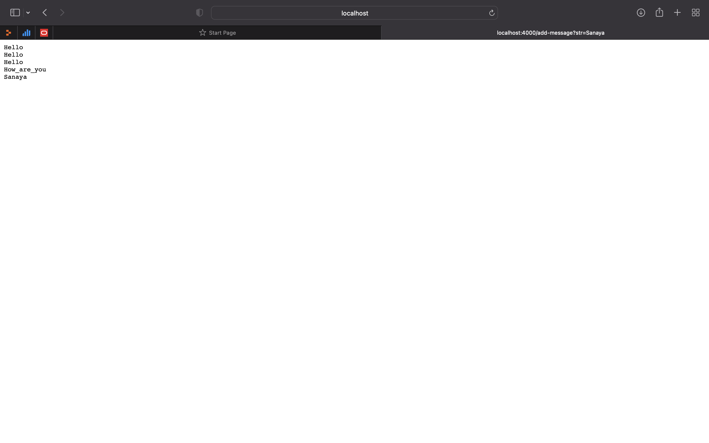
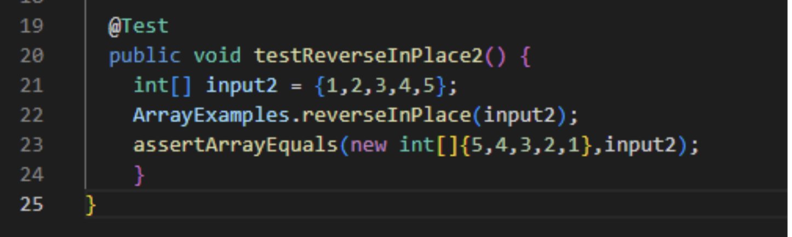

# Lab Report 2 - Servers and Bugs (Week 3)
## Part 1
Find below my code for StringServer

Using add-messages:
1. This is with only one string addition. The url is _localhost:4000/add-message?str=Hello_ which displays "Hello"
For this, `handleRequest` is called. The relevant argument is __URI url__. The string str gets changed from _null to Hello_

2. I added a few more strings. This is the image of the url that adds "Sanaya". Here, the same method i.e. `handleRequest` is called and the relevenat argument is __URI url__ as well. The string changed from just "Hello" to Hello Hello Hello How_are_you Sanaya

This is what the screen looks like after adding all these strings


## Part 2
Failure Inducing Input:
```
@Test
public void testReverseInPlace20) f
int[] input2 = (1,2,3,4,5};
ArrayExamples.reverseInPlace(input2):
assertArrayEquals (new int[]{5,4,3,2,1},inputz);
}
7
```


