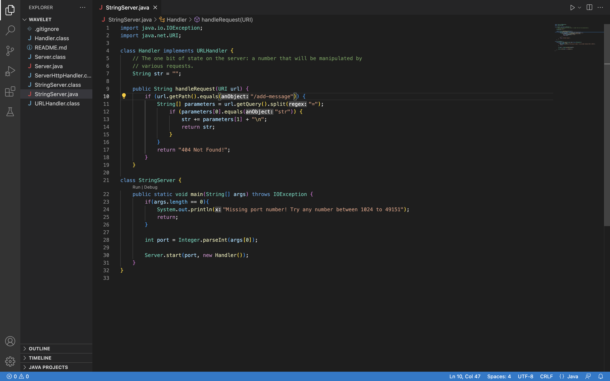

# Lab Report 2 - Servers and Bugs (Week 3)
## Part 1
Find below my code for StringServer

Using add-messages:
1. This is with only one string addition. The url is _localhost:4000/add-message?str=Hello_ which displays "Hello"

