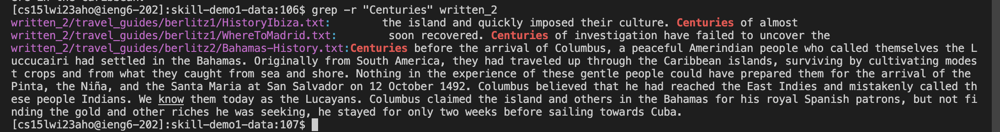
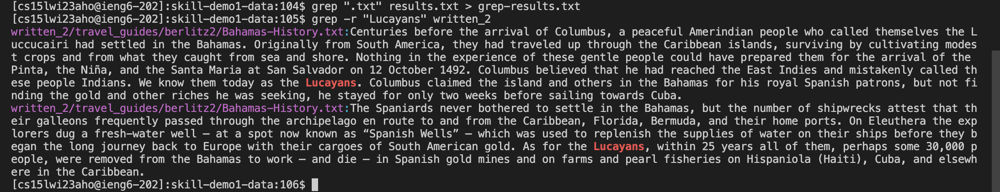
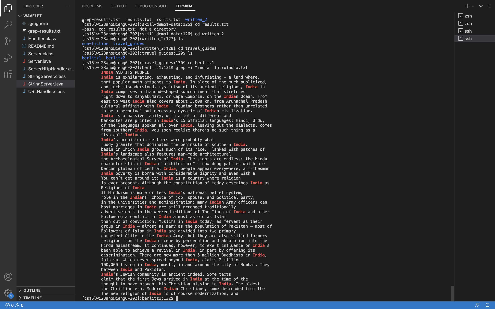
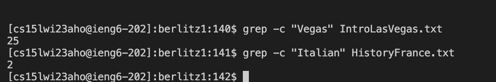
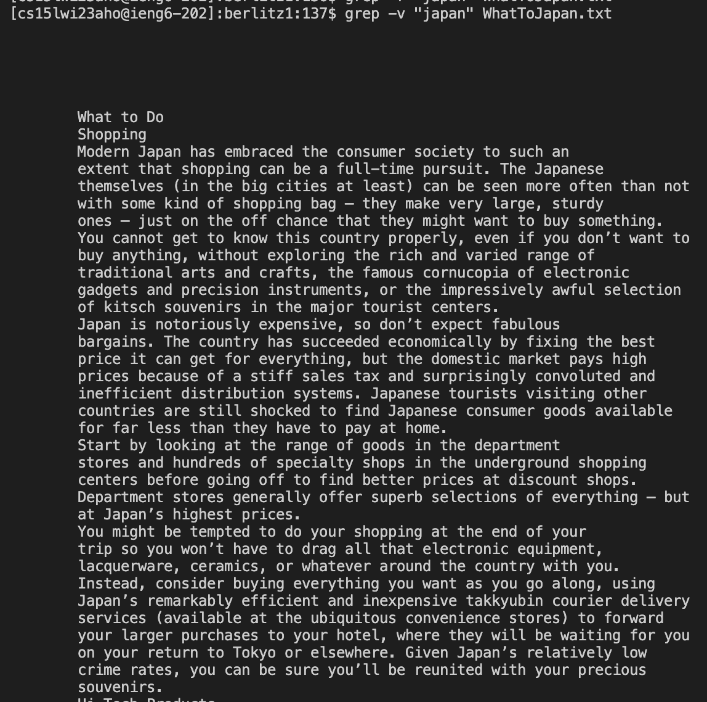
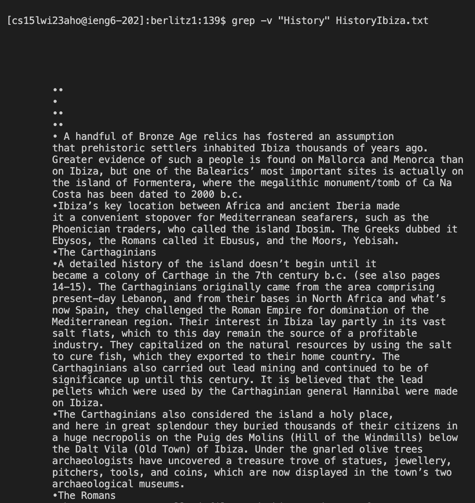
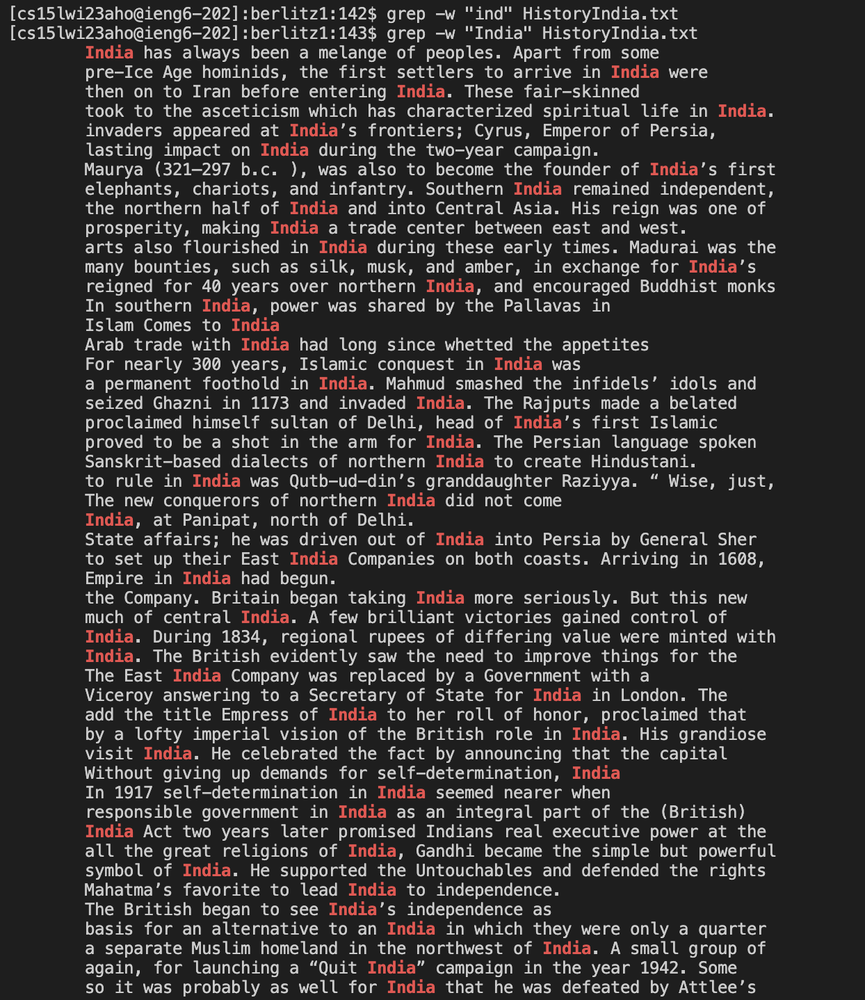

# Lab Report 3
Command chosen: grep\
grep is a command line tool to search for strings, input files, matching lines, patterns in files.\

## 1. `-r`
`r` is used to search for a string recursively in all directories.\
Here are two examples:

It is important to note that `-r` looks at uppercase and lower case. Searching for "Centuries" will give results for Centuries with 'C' capatalized. 

## 2. `-i`
`i` is basically `r` but ignoring case sensitivity. It searches for the relevant string no matter if it's uppercase or lowercase.\
Here are two examples:

## 3. `-c`
`c` counts the total number of lines where the string pattern appears\
Here are two examples:

## 4. `-v`
`v` is used to invert the grep output. It lists all the lines that do not contain the mentioned string\
Here are two examples:

## 5. `-w`
`w` searches for the line containing the exact matching word\
Here are two examples:\
In the first example, since there are no words that say exactly "ind", there are no results. In the sceond example, we see all "India" results. 

Click here for the [sources](https://www.digitalocean.com/community/tutorials/grep-command-in-linux-unix)
