# LAB REPORT 4
## Github and Login Command-Line Setup

This is how to log into your account without setting up your password

Keys used: `<enter>`
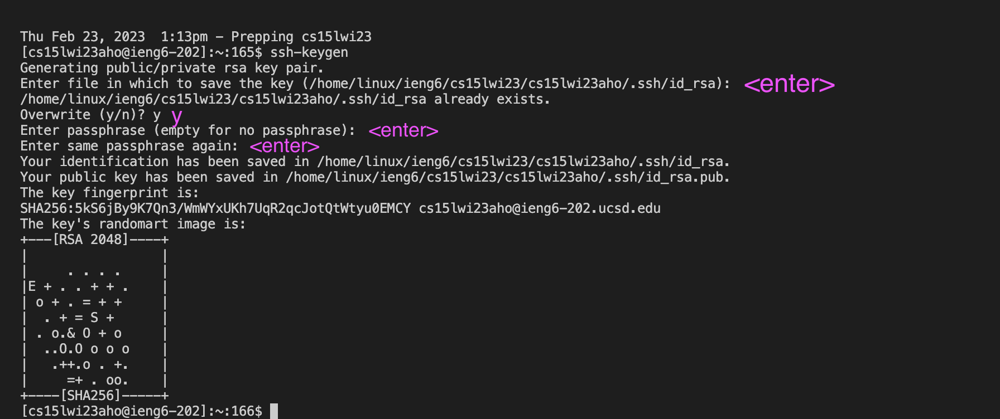
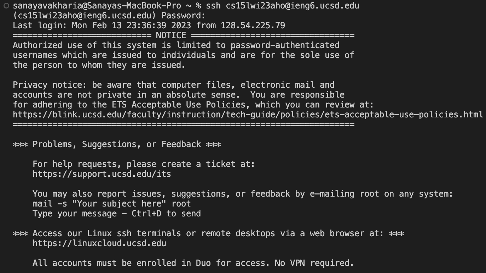
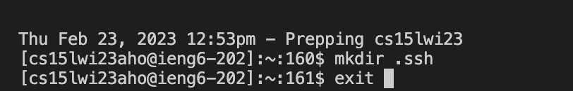
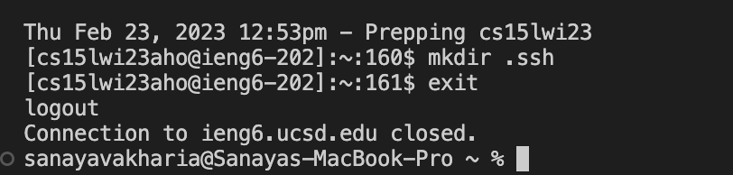
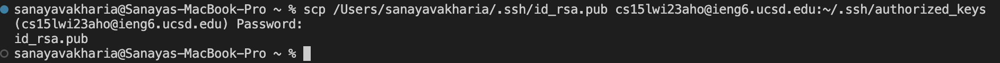
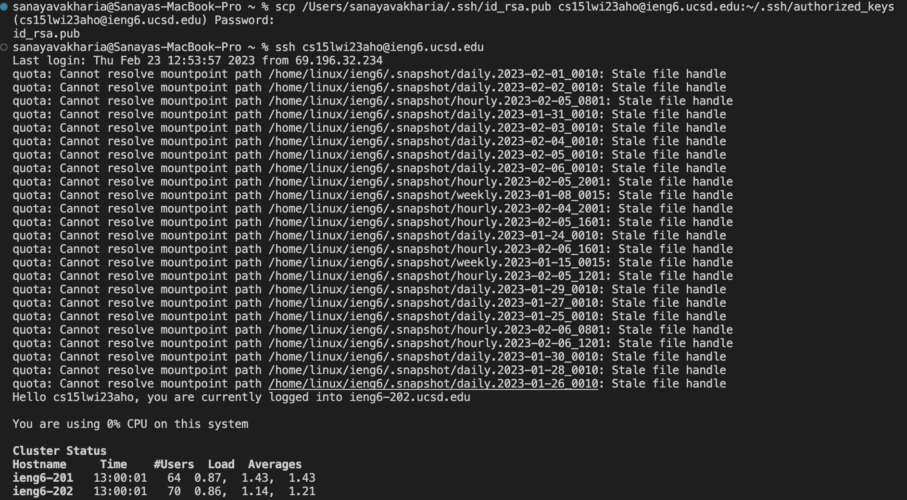
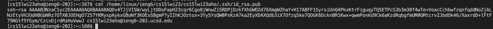
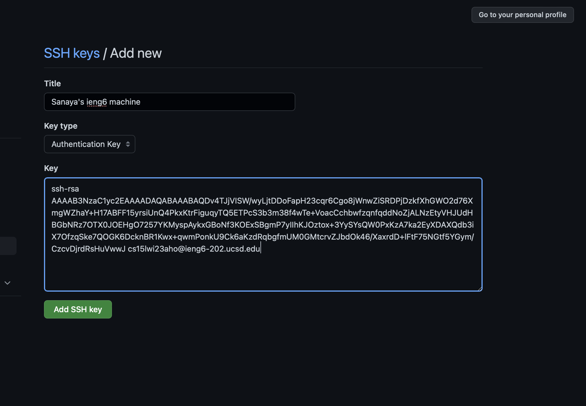
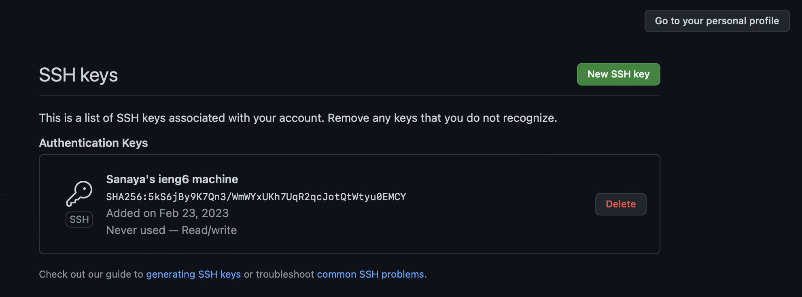
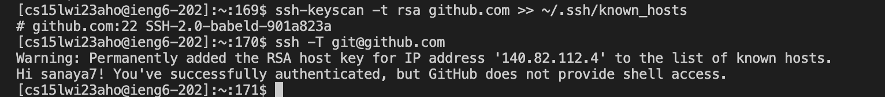
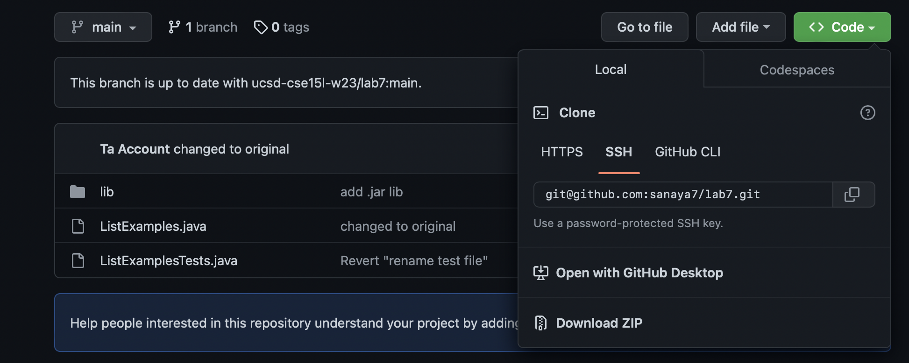

After setting up SSH login, I cloned the github forked link:

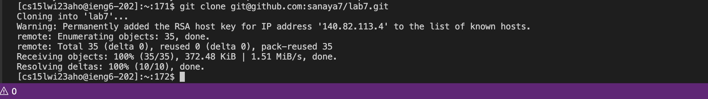

Now working on the code: \
```
javac -cp .:lib/hamcrest-core-1.3.jar:lib/junit-4.13.2.jar *.java  <Enter>    
java -cp .:lib/hamcrest-core-1.3.jar:lib/junit-4.13.2.jar org.junit.runner.JUnitCore JavaExamplesTests <Enter>
```

The tests fail which means there's soemthing wrong in the code.

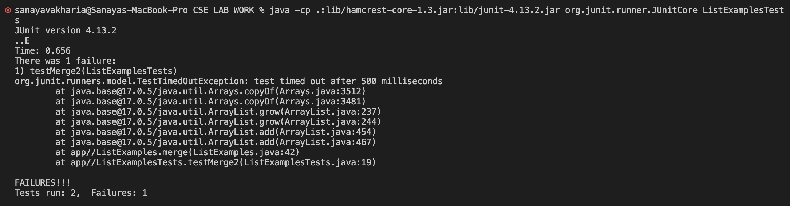

Using nano, we fix the code in the terminal itself using nano;

I pressed the `<Enter>` key 42 times to reach the relevant line.\
Then, I used: `<right> <right> <right> <right> <right> <right> <right> <right> <right> <right> <right> <right>` (12 times) to reach the required index to make the change.\
The change is: index1 changed to index2.\
Next, I use `ctrl+O` to save the change, followed by `ctrl+X` to exit the nano terminal. 

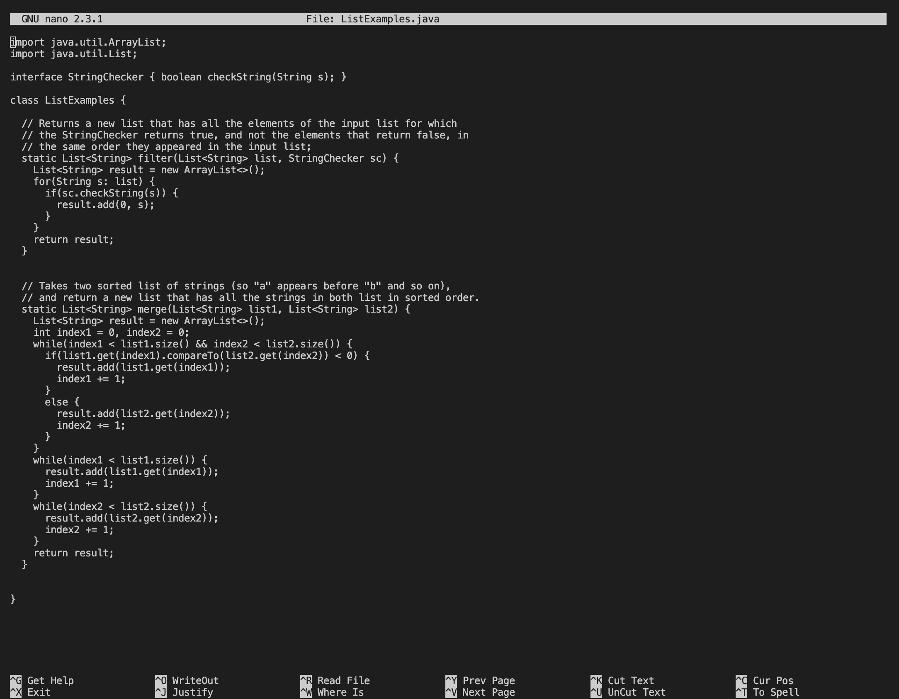

After making the changes, i.e. changing index1 to index2, the tests pass

`<up> <up> <up> <up> <up>` to get `javac -cp .:lib/hamcrest-core-1.3.jar:lib/junit-4.13.2.jar *.java`  `<Enter>` \
`<up> <up> <up> <up> <up` to get `java -cp .:lib/hamcrest-core-1.3.jar:lib/junit-4.13.2.jar org.junit.runner.JUnitCore JavaExamplesTests` `<Enter>`


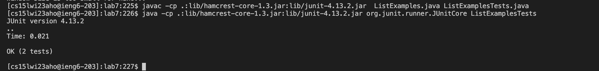

Here, i used `<up>` command five times to get the compiler command and then `<up>` another five times to get the run command. 

Now, I use commands like `int` and `commit` to save the changes.

`git init`: Initializes a new Git repository in the current directory or reinitializes an existing one.\
`git add ListExamples.java`: Adds the file ListExamples.java to the staging area, preparing it for the next commit.\
`git add <ListExamples.java>`: This command is invalid due to the use of angle brackets. The correct syntax is git add ListExamples.java without the angle brackets.\
`git add <ListExamples>`: This command is also invalid due to the use of angle brackets. The correct syntax is git add ListExamples without the angle brackets. However, this command failed because there is no file or directory named ListExamples in the current directory.\
`git commit -m "index1 changed to index2"`: Commits the changes in the staging area to the repository with the message "index1 changed to index2".\
`git remote add origin https://github.com/sanaya7/lab7.git`: Adds a new remote called "origin" with the URL "https://github.com/sanaya7/lab7.git".

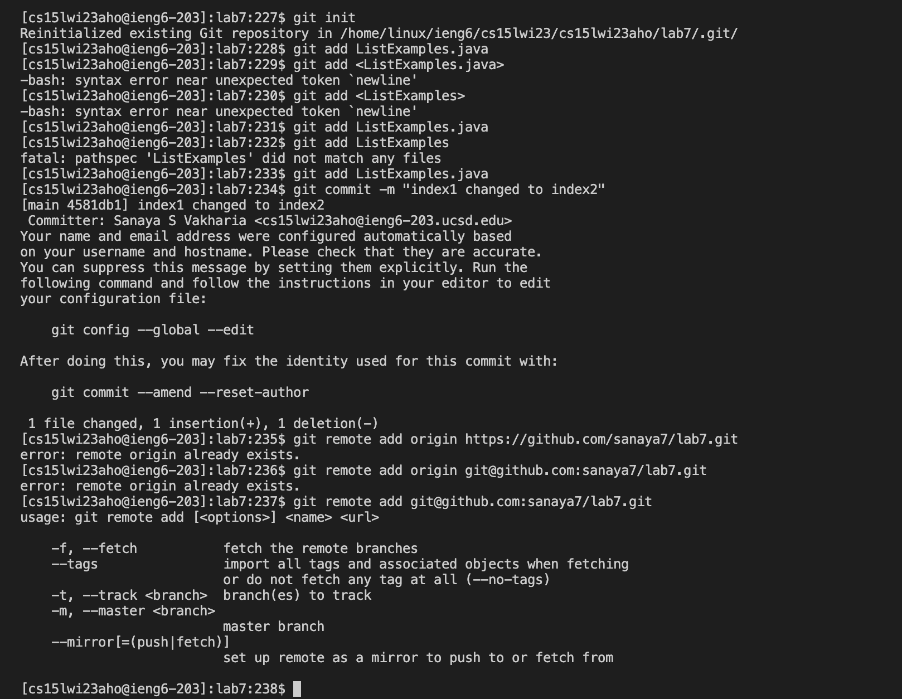

