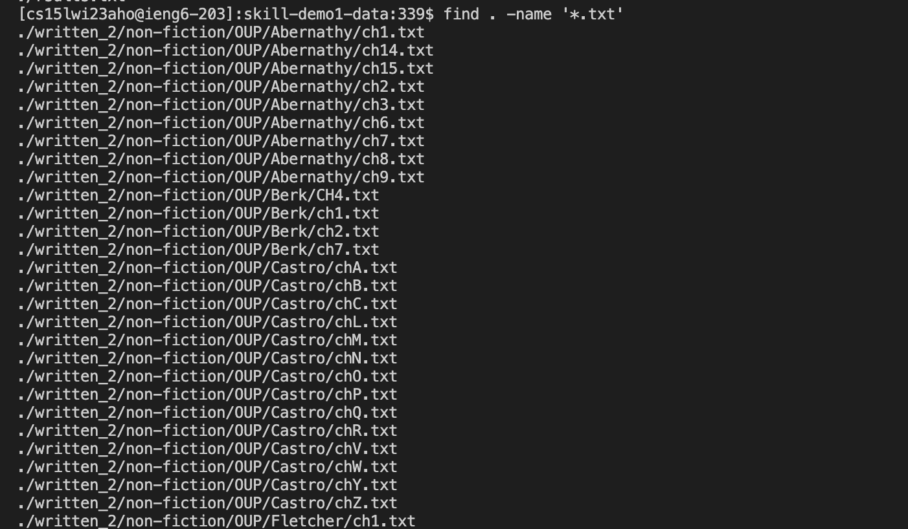
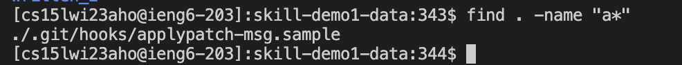
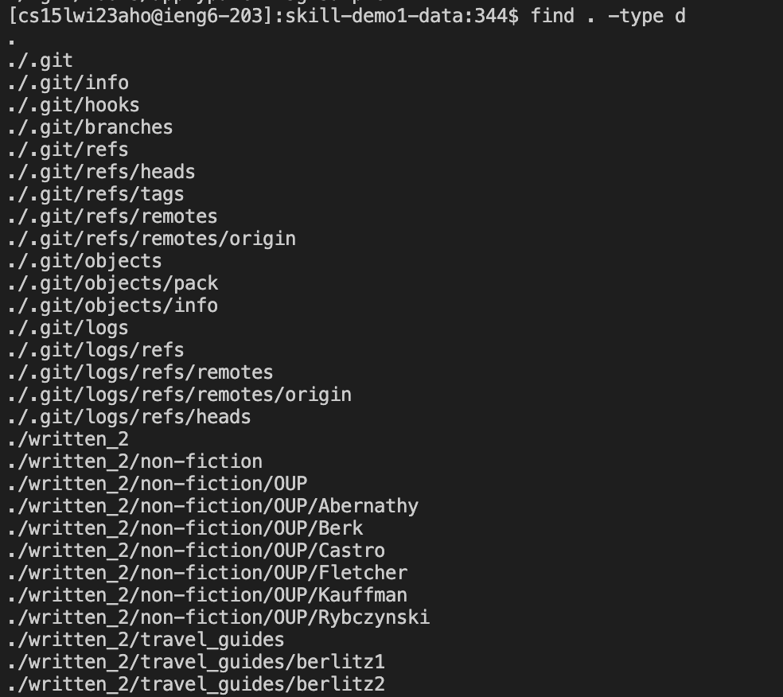
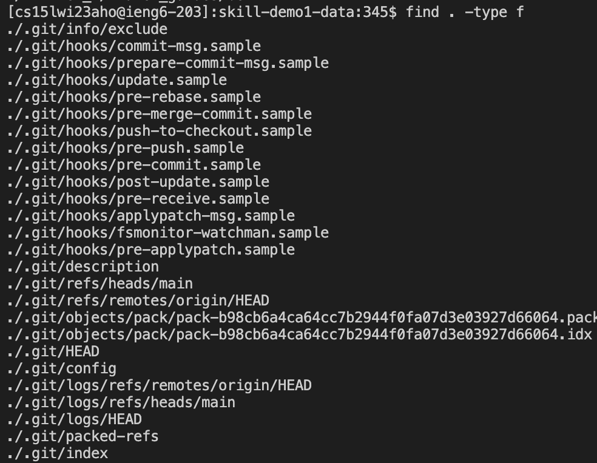
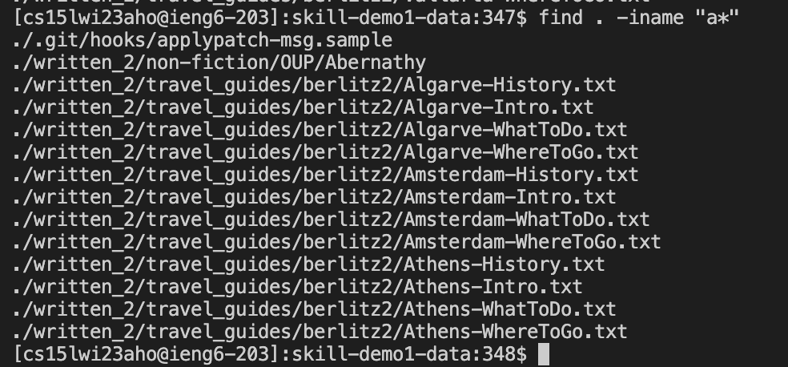
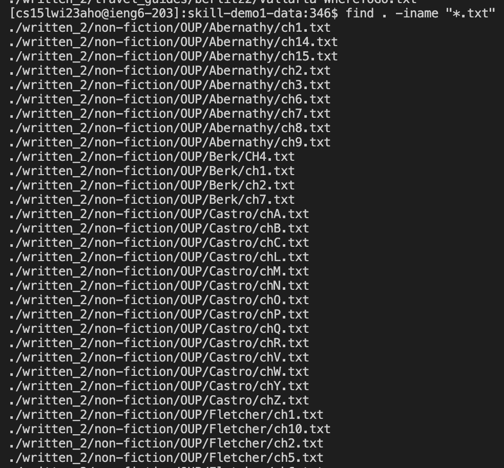
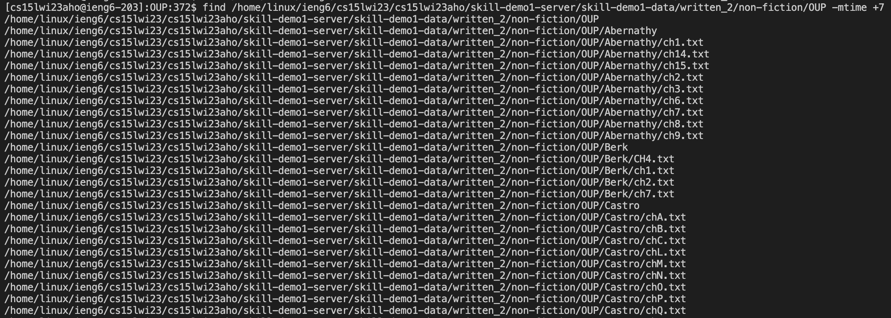
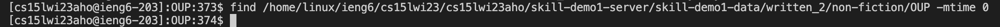

# Lab Report - 5
Command chosen: find\
The find command, as the name implies, is used to find things. It allows users to search for files and directories based on various criteria, such as file names, permissions, sizes, and modification times. The find command can search for files and directories recursively in a given directory and its subdirectories, making it useful for managing and organizing large directory structures.

The syntax is: `find [path] [expression]`

*__Path__*: The directory to start the search from. If not specified, the search starts from the current directory.\
*__Expression__*: The set of criteria used to filter the files and directories. It can include various options, tests, and actions.

## 1. `-name`
The `-name` command is used when you know the name of a file but can't remember where you saved it.\
Use this to search for files with a specific name or pattern.

For example, to find all .pdf files in a directory and its subdirectories, you can use the command find . -name "*.pdf". This is useful for finding specific types of files, such as images, videos, or documents.


To find all files in the repository with the extension .txt, you can use the following command:

```
[cs15lwi23aho@ieng6-203]:skill-demo1-data:339$ find . -name '*.txt'
./written_2/non-fiction/OUP/Abernathy/ch1.txt
./written_2/non-fiction/OUP/Abernathy/ch14.txt
./written_2/non-fiction/OUP/Abernathy/ch15.txt
./written_2/non-fiction/OUP/Abernathy/ch2.txt
./written_2/non-fiction/OUP/Abernathy/ch3.txt
./written_2/non-fiction/OUP/Abernathy/ch6.txt
./written_2/non-fiction/OUP/Abernathy/ch7.txt
./written_2/non-fiction/OUP/Abernathy/ch8.txt
./written_2/non-fiction/OUP/Abernathy/ch9.txt
./written_2/non-fiction/OUP/Berk/CH4.txt
./written_2/non-fiction/OUP/Berk/ch1.txt
…
./written_2/skill-demo1-data/written_2/skill-demo1-data/written_2/skill-demo1-data/written_2/travel_guides/berlitz2/Vallarta-WhereToGo.txt
./written_2/skill-demo1-data/results.txt
./results.txt
./grep-results.txt
./rsults.txt
```

Here is the screenshot of how the above command looks:



To search for all files that start with the letter "a", you can use the following command:

```
[cs15lwi23aho@ieng6-203]:skill-demo1-data:343$ find . -name "a*"
./.git/hooks/applypatch-msg.sample
```

Here is the screenshot of how the above command looks:



## 2. `-type`
Use the find command with the `-type` option to search for files of a specific type.

For example, to find all directories in a directory and its subdirectories, you can use the command find . -type d. This is useful for finding directories that contain specific types of files or for navigating a large directory structure.

To find all directories in the repository, you can use the following command:

```
[cs15lwi23aho@ieng6-203]:skill-demo1-data:344$ find . -type d
.
./.git
./.git/info
./.git/hooks
./.git/branches
./.git/refs
./.git/refs/heads
./.git/refs/tags
./.git/refs/remotes
./.git/refs/remotes/origin
./.git/objects
./.git/objects/pack
./.git/objects/info
./.git/logs
./.git/logs/refs
./.git/logs/refs/remotes
./.git/logs/refs/remotes/origin
./.git/logs/refs/heads
./written_2
./written_2/non-fiction
./written_2/non-fiction/OUP
./written_2/non-fiction/OUP/Abernathy
./written_2/non-fiction/OUP/Berk
./written_2/non-fiction/OUP/Castro
./written_2/non-fiction/OUP/Fletcher
./written_2/non-fiction/OUP/Kauffman
./written_2/non-fiction/OUP/Rybczynski
./written_2/travel_guides
./written_2/travel_guides/berlitz1
./written_2/travel_guides/berlitz2
```

Here is the screenshot of how the above command looks:



You can replace `d` with other letters to search for other types of files. For example, to search for all regular files in the repository, you can use the following command: 

```
[cs15lwi23aho@ieng6-203]:skill-demo1-data:345$ find . -type f
./.git/info/exclude
./.git/hooks/commit-msg.sample
./.git/hooks/prepare-commit-msg.sample
./.git/hooks/update.sample
./.git/hooks/pre-rebase.sample
./.git/hooks/pre-merge-commit.sample
./.git/hooks/push-to-checkout.sample
./.git/hooks/pre-push.sample
./.git/hooks/pre-commit.sample
./.git/hooks/post-update.sample
./.git/hooks/pre-receive.sample
./.git/hooks/applypatch-msg.sample
./.git/hooks/fsmonitor-watchman.sample
./.git/hooks/pre-applypatch.sample
./.git/description
…
./written_2/travel_guides/berlitz2/Vallarta-History.txt
./written_2/travel_guides/berlitz2/Vallarta-WhatToDo.txt
./written_2/travel_guides/berlitz2/Vallarta-WhereToGo.txt
```

Here is the screenshot of how the above command looks:



## 3. `-iname`
Use the find command with the -iname option is used to search for files with a specific name or pattern, ignoring case sensitivity. If you can't remember the exact name of the file, or you're not sure whether you capitalized any characters, you can do a partial and case-insensitive search using this. 

This is useful for finding files that have similar names but different cases, such as file.txt, File.txt, and FILE.TXT.

To find all files in the repository with the extension .txt, you can use the following command: 

```
[cs15lwi23aho@ieng6-203]:skill-demo1-data:346$ find . -iname "*.txt"
./written_2/non-fiction/OUP/Abernathy/ch1.txt
./written_2/non-fiction/OUP/Abernathy/ch14.txt
./written_2/non-fiction/OUP/Abernathy/ch15.txt
./written_2/non-fiction/OUP/Abernathy/ch2.txt
./written_2/non-fiction/OUP/Abernathy/ch3.txt
./written_2/non-fiction/OUP/Abernathy/ch6.txt
./written_2/non-fiction/OUP/Abernathy/ch7.txt
./written_2/non-fiction/OUP/Abernathy/ch8.txt
./written_2/non-fiction/OUP/Abernathy/ch9.txt
./written_2/non-fiction/OUP/Berk/CH4.txt
./written_2/non-fiction/OUP/Berk/ch1.txt
./written_2/non-fiction/OUP/Berk/ch2.txt
./written_2/non-fiction/OUP/Berk/ch7.txt
…
./written_2/travel_guides/berlitz2/PuertoRico-History.txt
./written_2/travel_guides/berlitz2/PuertoRico-WhatToDo.txt
./written_2/travel_guides/berlitz2/PuertoRico-WhereToGo.txt
./written_2/travel_guides/berlitz2/Vallarta-History.txt
./written_2/travel_guides/berlitz2/Vallarta-WhatToDo.txt
./written_2/travel_guides/berlitz2/Vallarta-WhereToGo.txt
```

This will search for all files in the current directory and its subdirectories that have a .txt extension, regardless of whether the extension is uppercase or lowercase

This is what an image of the above code looks like:



You can replace *.txt with any other file name or pattern that you want to search for. For example, to search for all files that start with the letter "a", ignoring case sensitivity, you can use the following command: 

```
[cs15lwi23aho@ieng6-203]:skill-demo1-data:347$ find . -iname "a*"
./.git/hooks/applypatch-msg.sample
./written_2/non-fiction/OUP/Abernathy
./written_2/travel_guides/berlitz2/Algarve-History.txt
./written_2/travel_guides/berlitz2/Algarve-Intro.txt
./written_2/travel_guides/berlitz2/Algarve-WhatToDo.txt
./written_2/travel_guides/berlitz2/Algarve-WhereToGo.txt
./written_2/travel_guides/berlitz2/Amsterdam-History.txt
./written_2/travel_guides/berlitz2/Amsterdam-Intro.txt
./written_2/travel_guides/berlitz2/Amsterdam-WhatToDo.txt
./written_2/travel_guides/berlitz2/Amsterdam-WhereToGo.txt
./written_2/travel_guides/berlitz2/Athens-History.txt
./written_2/travel_guides/berlitz2/Athens-Intro.txt
./written_2/travel_guides/berlitz2/Athens-WhatToDo.txt
./written_2/travel_guides/berlitz2/Athens-WhereToGo.txt
[cs15lwi23aho@ieng6-203]:skill-demo1-data:348$ 
```

This will search for all files in the current directory and its subdirectories that start with the letter "a", regardless of whether the first letter is uppercase or lowercase.

Here is an image of what it looks like:



## 4. `-mtime`
The `-mtime` option in the find command is used to search for files based on their modification time. It allows you to search for files that were modified within a certain time frame, specified in days.

This command line option can be used for cleaning up old log files. If you have a directory of log files that you want to clean up periodically, you can use the find command with `-mtime` to find all the log files that are older than a certain number of days and delete them.

For example, this command lists all files in OUP modified more than 7 days ago

```
[cs15lwi23aho@ieng6-203]:OUP:372$ find /home/linux/ieng6/cs15lwi23/cs15lwi23aho/skill-demo1-server/skill-demo1-data/written_2/non-fiction/OUP -mtime +7
/home/linux/ieng6/cs15lwi23/cs15lwi23aho/skill-demo1-server/skill-demo1-data/written_2/non-fiction/OUP
…
/home/linux/ieng6/cs15lwi23/cs15lwi23aho/skill-demo1-server/skill-demo1-data/written_2/non-fiction/OUP/Rybczynski/ch1.txt
/home/linux/ieng6/cs15lwi23/cs15lwi23aho/skill-demo1-server/skill-demo1-data/written_2/non-fiction/OUP/Rybczynski/ch2.txt
/home/linux/ieng6/cs15lwi23/cs15lwi23aho/skill-demo1-server/skill-demo1-data/written_2/non-fiction/OUP/Rybczynski/ch3.txt
```
This is how it looks:



For example, this command lists all files in OUP modified less than 24 hours ago. There are no results which means none of the files were modified within 24 hours.

```
[cs15lwi23aho@ieng6-203]:OUP:373$ find /home/linux/ieng6/cs15lwi23/cs15lwi23aho/skill-demo1-server/skill-demo1-data/written_2/non-fiction/OUP -mtime 0 
[cs15lwi23aho@ieng6-203]:OUP:374$ 
```

This is how it looks:



You can find the sources used [here](https://www.redhat.com/sysadmin/linux-find-command)
